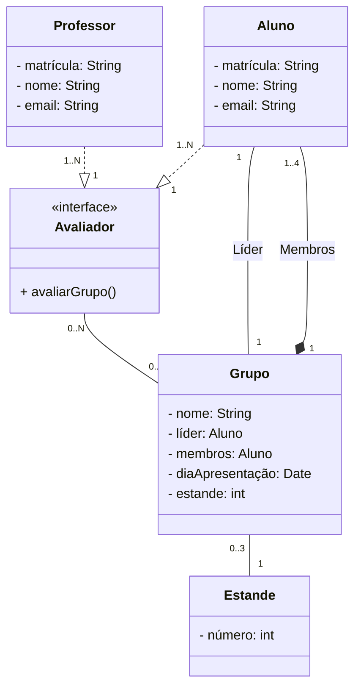

# Sistema de avaliação para o InovaWeek
##### Integrantes: Bruno Lokchin, Vitor Lugon, João Lucas Assis

### Sistema que auxilia a avaliação e inserção das notas dos grupos do InovaWeek 2023.
> Escrito em TypeScript, banco de dados SQLite, ORM Prisma, servidor Express, visualização EJS.

A estrutura das classes foram baseadas no padrão de projeto Singleton, como está abaixo:


1. Professor e Aluno podem avaliar, então foi definida a interface Avaliador que possui o método ```avaliarGrupo()``` para ser utilizada.
2. Um grupo é constituído por 1 a 4 alunos, sendo um deles o líder.
3. O grupo faz parte de um Estande, e possui um dia de apresentação.

<br>

<details>
<summary>Serviços</summary>
<p>

#### [AlunoService](https://github.com/lokchin/projeto_inova_POO2/blob/main/src/services/AlunoService.ts)
> Lógica do CRUD do Aluno no banco de dados.
```app
import { Prisma, PrismaClient } from "@prisma/client";

const prisma = new PrismaClient();

class AlunoService {

    async insert(aluno: Prisma.AlunoCreateInput) {
    }

    async update(matricula: string, aluno: Prisma.AlunoCreateInput) {
    }

    async delete(matricula: string) {
    }

    async getAll() {
    }
}

export default new AlunoService();
```
#### [GrupoService](https://github.com/lokchin/projeto_inova_POO2/blob/main/src/services/GrupoService.ts)
> Lógica do CRUD do Grupo no banco de dados.
```app
import { Prisma, PrismaClient } from "@prisma/client";

const prisma = new PrismaClient();

class GrupoService {

    async insert(grupo: Prisma.GrupoCreateInput) {
    }

    async update(nome: string, grupo: Prisma.GrupoCreateInput) {
    }

    async delete(nome: string) {
    }

    async getAll() {
    }
}

export default new GrupoService();
```
#### [ProfessorService](https://github.com/lokchin/projeto_inova_POO2/blob/main/src/services/ProfessorService.ts)
> Lógica do CRUD do Professor no banco de dados.
```app
import { Prisma, PrismaClient } from "@prisma/client";

const prisma = new PrismaClient();

class ProfessorService {

    async insert(professor: Prisma.ProfessorCreateInput) {
    }

    async update(matricula: string, professor: Prisma.ProfessorCreateInput) {
    }

    async delete(matricula: string) {
    }

    async getAll() {
    }
}

export default new ProfessorService();
```
#### [EstandeService](https://github.com/lokchin/projeto_inova_POO2/blob/main/src/services/EstandeService.ts)
> Lógica do CRUD do Estande no banco de dados.
```app
import { Prisma, PrismaClient } from "@prisma/client";

const prisma = new PrismaClient();

class EstandeService {

    async insert(estande: Prisma.EstandeCreateInput) {
    }

    async delete(numero: string) {
    }

    async getAll() {
    }
}

export default new EstandeService();
```

</p>
</details>


<details>
<summary>Controladores</summary>
<p>

#### [AlunoController](https://github.com/lokchin/projeto_inova_POO2/blob/main/src/controllers/AlunoController.ts)
> Recebe requisições sobre o Aluno, manipula o banco de dados e retorna uma resposta.
```app
import express from 'express';
import AlunoService from '../services/AlunoService';
import { Prisma } from '@prisma/client';

class AlunoController {

    public async insert(req: express.Request, res: express.Response) {
    }

    public async update(req: express.Request, res: express.Response) {
    }

    public async delete(req: express.Request, res: express.Response) {
    }

    public async getAll(req: express.Request, res: express.Response) {
    }
}

export default new AlunoController();
```
#### [GrupoController](https://github.com/lokchin/projeto_inova_POO2/blob/main/src/controllers/GrupoController.ts)
>  Recebe requisições sobre o Grupo, manipula o banco de dados e retorna uma resposta.
```app
import express from 'express';
import GrupoService from '../services/GrupoService';
import { Prisma } from '@prisma/client';

class ProfessorController {

    public async insert(req: express.Request, res: express.Response) {
    }

    public async update(req: express.Request, res: express.Response) {
    }

    public async delete(req: express.Request, res: express.Response) {
    }

    public async getAll(req: express.Request, res: express.Response) {
    }
}

export default new ProfessorController();
```
#### [ProfessorController](https://github.com/lokchin/projeto_inova_POO2/blob/main/src/controllers/ProfessorController.ts)
>  Recebe requisições sobre o Professor, manipula o banco de dados e retorna uma resposta.
```app
import express from 'express';
import ProfessorService from '../services/ProfessorService';
import { Prisma } from '@prisma/client';

class ProfessorController {

    public async insert(req: express.Request, res: express.Response) {
    }

    public async update(req: express.Request, res: express.Response) {
    }

    public async delete(req: express.Request, res: express.Response) {
    }

    public async getAll(req: express.Request, res: express.Response) {
    }
}

export default new ProfessorController();
```
#### [EstandeController](https://github.com/lokchin/projeto_inova_POO2/blob/main/src/controllers/EstandeController.ts#L56)
>  Recebe requisições sobre o Estande, manipula o banco de dados e retorna uma resposta.
```app
import express from 'express';
import EstandeService from '../services/EstandeService';
import { Prisma } from '@prisma/client';

class EstandeController {

    public async insert(req: express.Request, res: express.Response) {
    }

    public async delete(req: express.Request, res: express.Response) {
    }

    public async getAll(req: express.Request, res: express.Response) {
    }
}

export default new EstandeController();
```

</p>
</details>

<details>
<summary>Rotas</summary>
<p>

#### [AlunoRoute](https://github.com/lokchin/projeto_inova_POO2/blob/main/src/routes/AlunoRoute.ts)
> Define as rotas para as requisições HTTP para o Aluno, e chama os controladores específicos.
```app
import { Router } from "express";
import AlunoController from "../controllers/AlunoController";

const AlunoRoute = Router();

AlunoRoute.get("/", AlunoController.getAll);

AlunoRoute.post("/insert", AlunoController.insert);

AlunoRoute.patch("/update/:matricula", AlunoController.update);

AlunoRoute.delete("/delete/:matricula", AlunoController.delete);

export default AlunoRoute;
```
#### [GrupoRoute](https://github.com/lokchin/projeto_inova_POO2/blob/main/src/routes/GrupoRoute.ts)
> Define as rotas para as requisições HTTP para o Grupo, e chama os controladores específicos.
```app
import { Router } from "express";
import GrupoController from "../controllers/GrupoController";

const GrupoRoute = Router();

GrupoRoute.get("/", GrupoController.getAll);

GrupoRoute.post("/insert", GrupoController.insert);

GrupoRoute.patch("/update/:nome", GrupoController.update);

GrupoRoute.delete("/delete/:nome", GrupoController.delete);

export default GrupoRoute;
```
#### [ProfessorRoute](https://github.com/lokchin/projeto_inova_POO2/blob/main/src/routes/ProfessorRoute.ts)
> Define as rotas para as requisições HTTP para o Professor, e chama os controladores específicos.
```app
import { Router } from "express";
import ProfessorController from "../controllers/ProfessorController";

const ProfessorRoute = Router();

ProfessorRoute.get("/", ProfessorController.getAll);

ProfessorRoute.post("/insert", ProfessorController.insert);

ProfessorRoute.patch("/update/:matricula", ProfessorController.update);

ProfessorRoute.delete("/delete/:matricula", ProfessorController.delete);

export default ProfessorRoute;
```
#### [EstandeRoute](https://github.com/lokchin/projeto_inova_POO2/blob/main/src/routes/EstandeRoute.ts)
> Define as rotas para as requisições HTTP para o Estande, e chama os controladores específicos.
```app
import { Router } from "express";
import EstandeController from "../controllers/EstandeController";

const EstandeRoute = Router();

EstandeRoute.get("/", EstandeController.getAll);

EstandeRoute.post("/insert", EstandeController.insert);

EstandeRoute.delete("/delete/:numero", EstandeController.delete);

export default EstandeRoute;
```

</p>
</details>


## Conexão
Foi criada uma conexão com o servidor Express na porta 8080 e a fonte de inserção utiliza o template EJS como views.

```app
import express from 'express';
import AlunoRoute from './routes/AlunoRoute';
import ProfessorRoute from './routes/ProfessorRoute';
import GrupoRoute from './routes/GrupoRoute';
import EstandeRoute from './routes/EstandeRoute';

export default class App {

    private app: express.Application;
    private port = 8080;

    constructor() {
        this.app = express();
        this.app.use(express.json());
        this.app.set('view engine', 'ejs');
        this.app.set('views', './src/views');
        this.app.use(express.urlencoded({ extended: true }));
        this.routes();
        this.listen();
    }

    public getApp(): express.Application {
        return this.app;
    }

    private listen(): void {
        this.app.listen(this.port, () => console.log("servidor iniciado na porta " + this.port));
    }

    private routes(): void {
        this.app.use("/aluno", AlunoRoute);
        this.app.use("/professor", ProfessorRoute);
        this.app.use("/grupo", GrupoRoute);
        this.app.use("/estande", EstandeRoute);
    }
}
```

## Visualizações
> A GUI para CRUD foi feito usando EJS


